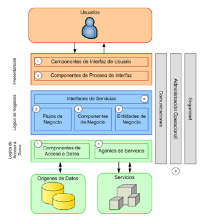

# Documento de Análisis y Diseño de Software

## 1. INTRODUCCIÓN

### 1.1. Propósito de este documento

Este documento presenta la propuesta de análisis y diseño de la solución de software para el proyecto Core Backing System, en él se describen los lineamientos del desarrollo de software, los patrones de diseño y el stack tecnológico.

El documento es de utilidad para la socialización de la arquitectura propuesta en el ciclo de vida de la aplicación; es de gran importancia la actualización del documento con el estado actual del proyecto en sus diferentes fases.

### 1.2. Alcance

El alcance será la documentación del análisis y diseño de Core Bancking System, establece un sistema bancario para ofrecer servicios al cliente final (cliente interno y externo). El diseño abarca un portal administrativo para el cliente interno para la gestión de los clientes externos y sus cuentas. Y otro portal para el cliente externo con mecanismos de autenticación para la consulta y operaciones con la cuenta o cuentas relacionadas.

### 1.3. Definiciones, Acrónicos y Abreviaturas

| TÉRMINO | DESCRIPCIÓN |
| :-----: | :---------: |
| Sistema bancario | Conjunto de aplicaciones, servicios y procesos que se utilizan en una entidad bancaria para llevar a cabo sus operaciones financieras. |
| ATM | Cajero Automático |
| IBAN | International Bank Account Number, número que identifica de manera única a una cuenta bancaria internacionalmente.|

## 2. Procesos de negocio

### 2.1. Proceso de Creación de Cliente Externo

1. El Asesor ingresa la información básica del cliente externo
2. El Sistema realiza el proceso de creación
3. El sistema verifica el cuenta.

## 3. Aproximación de la solución
### 3.1. Decisiones de Arquitectura 

La decisión de la arquitectura de software para un sistema bancario dependerá de muchos factores como el tamaño del sistema, numero de usuarios, el tipo de transacciones que se realizan, los requisitos de seguridad y disponibilidad.

El alcance del proyecto es un pequeño sistema bancario para el cliente final para las transacciones de consulta de saldo, retiros, consignaciones, transferencias de otros clientes y consulta de movimientos.

Se tomarán las siguientes arquitecturas para Core Backing System:

#### 3.1.1. Arquitectura en Capas: (Lizardo, 2011)

En esta arquitectura, el sistema se divide en capas lógicas, cada una de las cuales se encarga de un conjunto de funcionalidades específicas. En el caso en concreto una capa de presentación se encarga de mostrar la interfaz de usuario para el cliente externo y el cliente interno. La capa de negocio se encarga de llevar a cabo las operaciones financieras descritas anteriormente.

La capa de datos se encarga de los mecanismos para acceso a los datos y objetos de transformación de datos.

La capa de seguridad es una capa transversal que en cada capa da; servicios y definiciones clave para la autenticación y autorización de los usuarios y entre sistemas.

**Ventajas**: Esta arquitectura permite una mayor flexibilidad y escalabilidad.

    

_Imagen 1. Componentes de un Patrón de Arquitectura por Capas (Lizardo, 2011)_

#### 3.1.2. Arquitectura Basada en Servicios:

En esta arquitectura, el sistema se divide en componentes independientes que se comunican entre sí a través de servicios web. Cada componente se encarga de una parte específica del sistema y puede ser reutilizado en otros contextos.

Ventajas:

- Esta arquitectura permite una mayor integración con otros sistemas y una mayor flexibilidad para modificar y escalar el sistema.
- Permite comenzar con la definición de servicios macros, e ir avanzando a separar responsabilidades para que sean mas granulares; para llevar a tener micro servicios.

#### 3.1.3. Arquitectura Basada en Eventos:

En esta arquitectura, el sistema se divide en componentes que se comunican entre sí a través de eventos cuando las transacciones no dependan por si solos, sino dependen de la respuesta de otros sistemas.

Esta arquitectura basada en Eventos permite gestionar eventos de notificación a clientes cuando se realizan transacciones en sus cuentas de ahorro.

Cada componente podría suscribirse a eventos relevantes para su funcionamiento y generar eventos propios cuando sea necesario. Por ejemplo, el procesador de transacciones podría suscribirse a eventos de cambio de saldo para actualizar las cuentas de los clientes y generar eventos de transacción para notificar al gestor de alertas.

Ventajas:

- Al inicio del proyecto solo sea requerido manejar los eventos por mecanismos más sencillos para las notificaciones/alertas, pero esta arquitectura permite tener una mayor flexibilidad en cambios de los procesos.
- Permite la comunicación entre sistemas, si el banco requiere comunicarse con otros productos, para una escalabilidad.

Desventajas:

- La arquitectura basada en eventos puede tener algunos desafíos, generando mayor complejidad en el sistema y más componentes para el monitoreo y control de los eventos.

### 3.2. Principios y Patrones de Diseño

#### 3.2.1. Principios Solid

Comenzamos con definir el uso de Principio Solid con el Objetivo de mejorar la calidad y el mantenimiento del código; lo que puede reducir el tiempo y el costo de mantenimiento a largo plazo. También puede hacer que el código sea más fácil de entender y de trabajar para los desarrolladores.

#### 3.3.2. Clean Code:

Al seguir las buenas prácticas de Clean Code, se puede mejorar la legibilidad y la comprensibilidad del código, lo que puede facilitar la depuración y el mantenimiento. También puede hacer que sea más fácil trabajar en equipo y compartir el código con otros desarrolladores.

#### 3.3.3. TDD:

Al utilizar el TDD (Desarrollo Guiado por Pruebas), se pueden crear pruebas automatizadas que aseguren que el código cumple con los requisitos y funciona de manera correcta. Esto puede reducir los errores y mejorar la confianza en el sistema.

#### 3.3.4. DDD:

Al utilizar el DDD (Diseño Orientado al Dominio), se puede mejorar la modelización y la representación del dominio de negocio en el sistema. Esto puede facilitar la comprensión del sistema por parte de los usuarios y los desarrolladores y mejorar la flexibilidad y la escalabilidad del sistema.

### 3.3. Stack Tecnológico

#### 3.3.1. Lenguaje Tecnológico

Para el Sistema Bancario se establece el Lenguaje de Programación principal JAVA, específicamente la versión Java la Versión 17 LTS.

Ventajas:

- Portabilidad: Java es un lenguaje independiente de la plataforma, lo que significa que el código Java puede ser ejecutado en cualquier sistema operativo que tenga una máquina virtual Java (JVM). Esto puede ser beneficioso para un sistema bancario que necesita soportar diferentes plataformas o sistemas operativos.

- Escalabilidad: Java es un lenguaje de programación orientado a objetos que permite crear aplicaciones modulares y escalables. Esto puede ser beneficioso para un sistema bancario que necesita crecer o adaptarse a nuevos requisitos.

- Seguridad: Java incluye varias características de seguridad, como la gestión automática de memoria y la protección contra ataques de inyección de código. Esto puede ser beneficioso para un sistema bancario que maneja datos sensibles y necesita protegerse contra posibles vulnerabilidades.

- Comunidad y recursos: Java es un lenguaje de programación muy popular y cuenta con una amplia comunidad de desarrolladores y una gran cantidad de recursos disponibles en línea. Esto puede ser beneficioso para un sistema bancario que necesita soporte o recursos adicionales.

#### 3.3.2. Framework

Spring es un framework de desarrollo de aplicaciones Java que ofrece una amplia variedad de herramientas y componentes para facilitar el desarrollo de aplicaciones. Algunos de los frameworks de Spring que podrían ser útiles para un sistema bancario y sus ventajas son:

_*Spring Boot*_: Spring Boot es un framework que simplifica el proceso de configuración y despliegue de aplicaciones Java. Es especialmente útil para aplicaciones que necesitan un arranque rápido y una configuración mínima.

Algunas de las ventajas de Spring Boot son:

- Facilita la configuración y el despliegue de aplicaciones Java.
- Incluye una gran cantidad de dependencias y librerías útiles.
- Ofrece soporte para la creación de aplicaciones monolíticas o microservicios.

_*Spring MVC*_: Spring MVC es un framework que proporciona una estructura para el desarrollo de aplicaciones web basadas en el patrón de diseño MVC.

Algunas de las ventajas de Spring MVC son:

- Facilita la separación de responsabilidades entre la lógica de negocio, la vista y el controlador.
- Ofrece una gran cantidad de características útiles para el desarrollo de aplicaciones web, como validación de formularios y gestión de sesiones.

_Spring Security_: Spring Security es un framework que proporciona seguridad a las aplicaciones Java.

Algunas de las ventajas de Spring Security son:

- Proporciona una capa de seguridad para proteger la aplicación contra ataques comunes, como inyección de código o robo de sesión.
- Ofrece una gran cantidad de opciones de autenticación y autorización, como usuario y contraseña, tokens o certificados digitales.
- Facilita la integración con otras herramientas de seguridad, como autenticación basada en OAuth o LDAP.

_Spring Data_ es un proyecto de código abierto que proporciona una capa de abstracción para el acceso a datos en diversas bases de datos.

Algunas de las ventajas de utilizar Spring Data en un sistema bancario son:

- Simplifica el acceso a datos: Spring Data proporciona una capa de abstracción para el acceso a datos que facilita el uso de diferentes bases de datos y alivia la carga de programación. Esto puede ser beneficioso para un sistema bancario que necesita acceder a una gran cantidad de datos de manera rápida y eficiente.
- Aumenta la productividad: Spring Data proporciona una gran cantidad de características útiles para el acceso a datos, como la generación automática de consultas o el soporte para transacciones. Esto puede aumentar la productividad de los desarrolladores y reducir el tiempo y el costo de desarrollo.
- Facilita la integración con otras herramientas: Spring Data se integra fácilmente con otras herramientas y frameworks de Spring, como Spring MVC o Spring Security. Esto puede facilitar la integración del sistema bancario con otras aplicaciones y servicios.
- Ofrece soporte para diferentes bases de datos: Spring Data soporta una amplia variedad de bases de datos, incluyendo MySQL, Oracle, MongoDB y muchas otras. Esto puede ser beneficioso para un sistema bancario que necesita soportar diferentes tipos de bases de datos.

#### 3.3.3. Librerías y Dependencias

Para el desarrollo de los Servicios del Core Banking System; se utilizarán las siguientes librerías.

- Lombok.
- Conector JDBC con PostgreSQL.
- Open API.

#### 3.3.4. Herramientas de Desarrollo:

Se utilizarán las siguientes herramientas de Desarrollo.

- Git
- IntelliJ IDEA Community Edition
- SonarLink.

#### 3.3.5. Herramientas de Integración Continua:

Azure DevOps es una plataforma de integración continua (CI) y entrega continua (CD) que ofrece una amplia variedad de herramientas y servicios para facilitar el desarrollo y la entrega de software.
Ventajas:

- Integración y entrega continua: Azure DevOps proporciona una plataforma completa para la integración y la entrega continua de software, incluyendo compilación, pruebas y despliegue. Esto puede aumentar la eficiencia y la calidad del proceso de desarrollo.
- Colaboración y seguimiento: Azure DevOps proporciona una amplia variedad de herramientas para facilitar la colaboración entre los miembros del equipo y el seguimiento del progreso del proyecto. Esto puede mejorar la comunicación y la coordinación entre los miembros del equipo.
- Escalabilidad y flexibilidad: Azure DevOps es una plataforma escalable y flexible que se puede adaptar a las necesidades de diferentes proyectos y equipos. Esto puede ser beneficioso para proyectos de software de gran tamaño o con requisitos cambiantes.

Desventajas:

- Costo: Azure DevOps es una plataforma de pago y puede ser costoso para proyectos de software de gran tamaño o con muchas necesidades de integración y entrega continua. Una alternativa estaría GitHub.
- Curva de aprendizaje: Azure DevOps ofrece una amplia variedad de herramientas y servicios, lo que puede requerir un tiempo de aprendizaje para dominar todas sus funcionalidades.

#### 3.3.6. Herramientas de Monitoreo:

#### 3.3.7. Bases de Datos:

PostgreSQL es un sistema de gestión de bases de datos relacionales que ha sido utilizado en diversos tipos de sistemas, incluyendo sistemas bancarios. Algunas de las ventajas de utilizar PostgreSQL en un sistema bancario son:

- Rendimiento y escalabilidad: PostgreSQL es un sistema de gestión de bases de datos muy rápido y escalable, lo que puede ser beneficioso para un sistema bancario que necesita manejar grandes cantidades de datos de manera rápida y eficiente.
- Fiabilidad y seguridad: PostgreSQL es un sistema de gestión de bases de datos muy fiable y seguro, con características como la gestión automática de transacciones, la replicación de datos y la protección contra ataques de inyección de código. 
- Licencia libre: PostgreSQL es un software de código abierto con una licencia libre que permite el uso y la modificación del código sin restricciones. 
- Amplia comunidad y recursos: PostgreSQL cuenta con una amplia comunidad de usuarios y desarrolladores y una gran cantidad de recursos disponibles en línea.
- Soporte para diferentes plataformas y lenguajes: PostgreSQL es compatible con una amplia variedad de plataformas y lenguajes de programación, como Linux, Windows, MacOS y Java, entre otros.
- Características avanzadas: PostgreSQL incluye una gran cantidad de características avanzadas, como el soporte para consultas complejas, la gestión de espacio de almacenamiento y la integración con otras bases de datos.

## 4. Repositorio de la Prueba

En el Siguiente Repositorio se tiene la Base del proyecto con los lineamientos aplicados.

[https://github.com/AngelSanchezT/CoreBankingSystem](https://github.com/AngelSanchezT/CoreBankingSystem)

## Bibliografía

Lizardo, M. E. (20 de 03 de 2011). Componentes de un Patrón de Arquitectura por Capas. Obtenido de [https://arevalomaria.wordpress.com/2011/03/20/componentes-de-un-patron-de-arquitectura-por-capas-2/](https://arevalomaria.wordpress.com/2011/03/20/componentes-de-un-patron-de-arquitectura-por-capas-2/)
